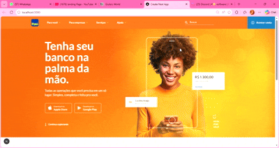

# 🟧 Itaú UI/UX Landing Page – Case Study



## 📄 Descrição

Este projeto é uma **Landing Page inspirada na interface do banco Itaú**, desenvolvida como **estudo de UI/UX** com foco em **simplicidade, clareza visual e experiência do usuário**.

A aplicação simula uma **tela institucional e funcional de banco digital**, priorizando:
- hierarquia visual clara  
- navegação intuitiva  
- microinterações suaves  
- design moderno e acessível  

O objetivo não é reproduzir funcionalidades reais do banco, mas **explorar boas práticas de design e front-end** aplicadas a produtos financeiros.

---

## 🎯 Objetivo do Projeto

- Praticar **UI/UX para produtos financeiros**
- Explorar **animações sutis** para melhorar a experiência
- Desenvolver uma landing page **moderna, responsiva e performática**
- Aplicar boas práticas com **Next.js App Router**

---

## 🚀 Funcionalidades

- **Layout responsivo** (desktop, tablet e mobile)
- **Seção Hero** com destaque visual e CTA
- **Busca simulada** com foco em UX
- **Menu com ícones intuitivos**
- **Animações com Framer Motion**
- **Componentização limpa e reutilizável**
- **Assets otimizados**

---

## 🧠 Foco em UI/UX

- Design inspirado em **produtos bancários reais**
- Uso de **espaçamento, contraste e tipografia** para leitura fácil
- **Animações não intrusivas**, focadas em feedback visual
- Interface simples, direta e confiável (essencial em produtos financeiros)

---

## 📁 Estrutura do Projeto

```
src/
├── app/
│   ├── globals.css
│   ├── layout.tsx
│   ├── page.tsx
│   └── components/
│       ├── Container.tsx
│       ├── Header.tsx
│       ├── ItemMenu.tsx
│       ├── Search.tsx
│       ├── SectionHero.tsx
│       └── SectionServices.tsx
│
└── assets/
    ├── bg-hero.jpg
    ├── logo.svg
    ├── icons/*.svg
    └── images/*.png
```

---

## 🛠 Tecnologias Utilizadas

- **Next.js 16 (App Router)**
- **React 19**
- **TypeScript**
- **Tailwind CSS**
- **Framer Motion**
- **ESLint**

---

## ⚡ Scripts Disponíveis

```bash
npm run dev     # ambiente de desenvolvimento
npm run build   # build de produção
npm start       # executar build
npm run lint    # lint
```

---

## 🎨 Animações

As animações foram implementadas com **Framer Motion**, priorizando:
- transições suaves
- entrada progressiva de elementos
- melhoria da percepção de fluidez da interface  

Sem comprometer performance ou usabilidade.

---

## 📌 Observações Importantes

⚠️ **Este projeto é apenas um estudo visual e técnico.**  
Não possui qualquer vínculo com o banco Itaú ou seus serviços oficiais.

---

## 👩‍💻 Autora

**Giulia Trevisan**  
Instagram: [@trevisandev](https://www.instagram.com/trevisandev)

---

## ✨ Considerações Finais

Este case demonstra como **UI/UX bem aplicado**, aliado a **boas práticas de front-end**, pode gerar interfaces **claras, modernas e agradáveis**, especialmente em contextos sensíveis como o financeiro.
